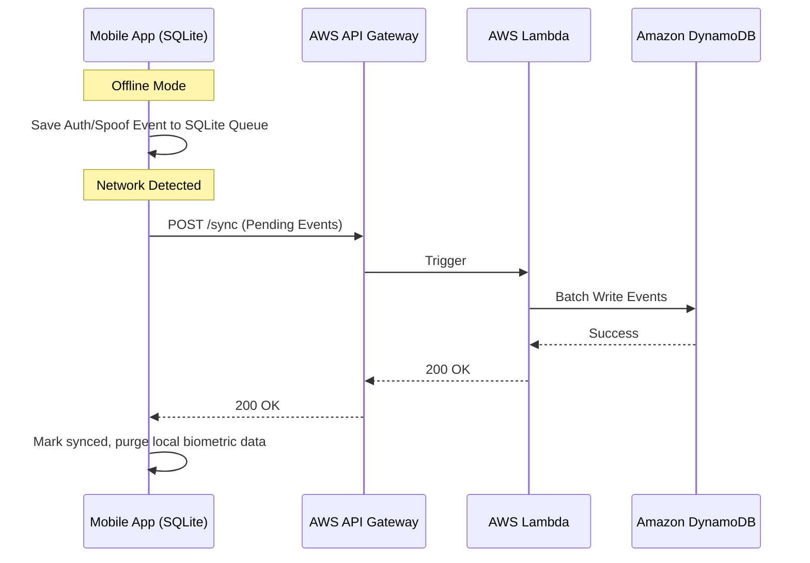

# Nirikshan
## Offline Facial Recognition + Liveness Detection (Hackathon 7.0)

Nirikshan is an edge-first, highly optimized mobile application for facial authentication with robust anti-spoofing capabilities. It is designed to work completely offline, ensuring fast and secure identity verification even in environments with zero network connectivity.

## Tech Stack & Core Components

| Component | Technology / Final Choice |
|-----------|-------------|
| **Face Detection** | YuNet (TFLite, ~300KB) |
| **Face Recognition** | MobileFaceNet + ArcFace FP16 (InsightFace buffalo_s, ~4MB) |
| **Liveness / Anti-spoofing** | MiniFASNetV2 INT8 TFLite (~600KB) |
| **Mobile Framework** | React Native (New Architecture / Fabric) |
| **Inference Engine** | `react-native-fast-tflite` (CPU/XNNPACK execution) |
| **Camera** | `react-native-vision-camera` (v4 with Frame Processors) |
| **Preprocessing** | JavaScript-based luminance normalization |
| **Local Storage** | `react-native-quick-sqlite` (cosine similarity evaluated in JS) |
| **Encryption** | AES-256 via `react-native-encrypted-storage` |
| **Cloud Sync** | AWS API Gateway -> Lambda -> DynamoDB |

## System Architecture

The application pipeline is built to run entirely on a native thread worklet without blocking the JavaScript thread, hitting a total latency of ~50-70ms on standard mid-range mobile processors.

```mermaid
flowchart TD
    subgraph App["React Native App (New Architecture / Fabric)"]
        subgraph Camera["react-native-vision-camera v4"]
            C[Back camera, 5 FPS cap, 720p resolution] --> FP[useFrameProcessor worklet <br> native thread, no JS bridge]
        end
        
        FP --> S1
        
        subgraph S1["STAGE 1: DETECTION"]
            D1[vision-camera-resize-plugin <br> 720p to 320x320 RGB] --> D2[YuNet TFLite ~300KB]
            D2 --> D3[Output: bounding box + 5 landmarks <br> Latency: ~5ms]
        end
        
        D3 --> Condition1{Face found?}
        Condition1 -- NO --> UI1[Show 'No face detected' UI]
        Condition1 -- YES --> S2
        
        subgraph S2["STAGE 2: PREPROCESSING"]
            P1[Crop face ROI to bounding box] --> P2[Affine warp to 112x112 using 5 landmarks]
            P2 --> P3[Luminance normalization <br> JS lookup table, ~2ms]
        end
        
        P3 --> S3
        
        subgraph S3["STAGE 3: LIVENESS"]
            L1[Resize to 128x128] --> L2[MiniFASNetV2 INT8 TFLite ~600KB]
            L2 --> L3[Output: P-real, P-spoof <br> Latency: ~15-20ms]
        end
        
        L3 --> Condition2{P-real > 0.7?}
        Condition2 -- NO --> UI2[Show 'Spoof detected' UI <br> Log attempt]
        Condition2 -- YES --> S4
        
        subgraph S4["STAGE 4: RECOGNITION"]
            R1[MobileFaceNet + ArcFace FP16 ~4MB] --> R2[Input: 112x112 aligned face]
            R2 --> R3[Output: 128-dim embedding <br> Latency: ~18ms]
        end
        
        R3 --> S5
        
        subgraph S5["STAGE 5: MATCHING"]
            M1[react-native-quick-sqlite] --> M2[Load embeddings -> cosine similarity in JS]
            M2 --> Condition3{Distance < 0.40?}
            Condition3 -- YES --> Auth1[AUTHENTICATED]
            Condition3 -- NO --> Auth2[REJECTED]
        end
        
        Auth1 --> S6
        Auth2 --> S6
        UI2 --> S6
        
        subgraph S6["STAGE 6: STORAGE & SYNC"]
            ST1[(SQLite)] 
            ST1 -.-> ST2[user_id, embedding BLOB, name, created_at]
            ST1 -.-> ST3[Auth log: event, user, result]
            ST1 -.-> ST4[AES-256 Key in Keystore/Keychain]
            ST1 -.-> ST5[Sync queue: pending events]
        end
    end
    
    style App fill:#f9f9f9,stroke:#333,stroke-width:2px
```

## Security & Privacy
- **Encrypted Local Storage:** All 128-dimensional biometric embeddings are encrypted at rest with AES-256-CBC.
- **Hardware-Backed Keys:** Encryption keys are securely bound to the device's hardware through Android Keystore / iOS Keychain (`react-native-encrypted-storage`).
- **Zero-Image Policy:** Raw images and crops are never stored on the disk nor transmitted to the cloud. Only the mathematical embeddings are retained.
- **Passive Liveness Detection:** Evaluates the frequency domain (Fourier spectrum) from the face crop to detect paper prints, high-res photos, and screen-replayed attacks.

## Cloud Sync Architecture
To accommodate long periods without network connectivity, the system incorporates an "Offline-First" queue.
1. Authentications, spoof attempts, and new enrollments are logged to a local SQLite database.
2. Upon network detection, the app synchronizes all pending events with an **AWS API Gateway -> Node.js Lambda -> DynamoDB** stack.
3. Once successfully synced, local biometric data can be safely purged from the edge device.

